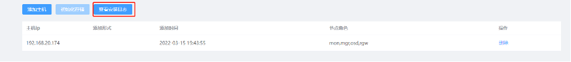

**仅做项目演示使用,已脱敏处理**

## 部署说明
### 基础环境说明
1）操作系统

仅支持x86架构

操作系统版本支持CentOS7.4、CentOS7.5、CentOS7.6、CentOS7.8、CentOS7.9

2）	硬件需求说明

部署过程中会检查服务器硬件，主要为CPU和内存

CPU要求至少16核

内存要求至少32G

3）	磁盘需求

系统盘: SSD 240G以上 或 300G SAS RAID1即可

数据盘: 每台节点至少两个SSD，用于存储HDD磁盘的元数据和对象数据的索引数据，需要做成直通模式。其他若干HDD磁盘在有阵列卡的情况下需要做成直通模

式或者每块磁盘做成RAID0

4）	网络说明

至少一个千兆网络，生产环境建议万兆网络

### 操作系统环境说明

此小节内容必须要做,否则无法通过环境检查

1）	配置固定IP地址

参考KM文档: 服务器IP修改

2）	关闭防火墙或开放必要的端口

参考KM文档: 系统安全加固

3）	关闭SELinux

```
setenforce 0
sed -i 's#SELINUX=enforcing#SELINUX=disabled#' /etc/selinux/config
```

4）	主机名设置

服务器主机名规范:

1. 不能以数字开头，大小写字母都可以，推荐使用小写字母
2. 不能有除 “-”和“.”之外的标点符号
3. 不能包含空格
  使用hostnamectl set-hostname 主机名 来设置主机名

5）	配置主机名解析
将配置的主机名和IP对应关系写入/etc/hosts文件中

格式为: IP地址 主机名

6）	设置NTP服务

参考KM文档: NTP时间同步

### 服务说明
1）	角色说明
管理节点对应ceph-mon和ceph-mgr服务

存储节点对应ceph-osd服务，只用于存储数据，如果在添加节点时不选中该角色，那么在初始化存储时不会看到该节点的磁盘列表

对象存储网关对应ceph-rgw服务，用于对外提供访问接口，我们ECM系统中配置S3_Url的值就是装有ceph-rgw服务的服务器地址加端口

生产集群环境建议mon、mgr、rgw服务分别部署三个，副本数三个，最多不要超过五个

2）	端口说明

对象存储默认端口8080

对象存储的接口地址: http://rgw_ip:8080

mgr端口7000,用户名/密码 admin/edoc2

Ceph_HealthUrl的地址配置为: http://mgr_ip:7000/api/auth

3）	默认用户

默认access_key： W6XCJFJX2ETBB387IK4D

默认secret_key: yh8wpPjiQ7wNfbGhKYkFHSNa7OBPHaIWjEQgOPlD

默认存储桶eDoc2

## 下载安装


下载地址:  http://x/gmcm

curl -O  http://x/gmcm

chmod +x gmcm && cp gmcm /usr/bin/

### 版本
执行`gmcm version`命令 输出版本信息


### 编辑配置文件
`gmcm edit`

该命令会调用vi编辑器，打开默认的配置文件默认配置文件存储路径在当前用户家目录的.env


app.listen 服务启动后对外访问的地址和端口，格式: app.listen=IP:PORT ，如果要所有ip地址都能访问，则省略IP地址: app.listen=:PORT

db.path 数据库存储路径,gmcm使用SQLite作为数据库，默认数据库文件为当前用户家目录的.gmcm.db

log.name 日志key名字

log.level 日志打印级别

log.format 日志格式，默认控制台模式，支持json格式

log.enable-caller 日志是否支持堆栈跟踪

log.enable-color 日志是否显示颜色

log.output-path 日志输出路径，默认输出到控制台

log.error-output-path 日志错误输出路径，默认输出到控制台

### 启动服务
直接执行 gmcm run


### 登录页

浏览器直接访问 http://ip:port，默认用户名密码为admin  edoc2


### 首页
登录后自动跳转到首页


### 添加主机
点击首页左上方添加主机按钮

 


⑴	填入服务器待安装存储服务的节点IP地址

⑵	添加按钮 添加多个节点

⑶	删除按钮 删除当前行的节点

⑷	节点角色 管理节点对应ceph-mon服务,存储节点对应ceph-osd服务,对象存储网关对应ceph-rgw服务


⑸	ssh端口号 只能填入数字类型

⑹	ssh密码 待安装服务的节点root用户密码

⑺	是否是免密登录，默认否，按钮为关闭状态，当按钮开启时SSH密码输入框会变灰

⑻	ssh远程连接测试，连接成功后下一步按钮会亮起


⑼	环境检测，点击后后台服务器对所有待添加的节点执行脚本检测，只有所有检查项都正常时下一步按钮才会亮起

总览信息


5.4 初始化存储
点击左上方初始化存储按钮

 


⑴	副本数 默认为可用节点数量，最多不能超出可用节点数量

⑵	Public网络：存储集群对外网络,客户端可以通过该网络访问到存储池

⑶	Cluster网络： 集群内部网络，用于存储集群各个节点之间副本数据同步，默认和Public网络使用同一个网络

⑷	点击可展开显示该节点的磁盘设备属性

⑸	磁盘类型 可修改磁盘类型，可以将HDD盘设置为SSD盘，当默认类型是SSD时，修改SSD盘为HDD盘这个操作不会生效.
注意: 将HDD盘设置为SSD盘是为了用作索引盘或元数盘，请按需修改不要将所有的HDD都设置为SSD请按需修改。

⑹	启用/禁用 按钮灰色表示禁用 亮起表示启用，默认启用

⑺	缓存设备 对应元数据磁盘
如果磁盘类型是ssd的并且缓存设备按钮为灰色那么这个磁盘就是索引盘
点击初始化之后，后台服务会执行ceph安装脚本，此过程大约需要30分钟左右，此时首页的初始化存储按钮会变灰 

进入系统执行以下命令可以使按钮变亮
```
sqlite3 ~/.gmcm.db
update statuses set status = 0;
```

### 查看安装日志

ceph的安装日志默认输出在系统的/tmp/ceph_install.log

Zw可以点击前端查看安装日志获取日志数据




### 验证
当日志中出现如下输出时说明存储已安装完成


进入系统中执行ceph -s 查看集群状态


访问管理页面查看


